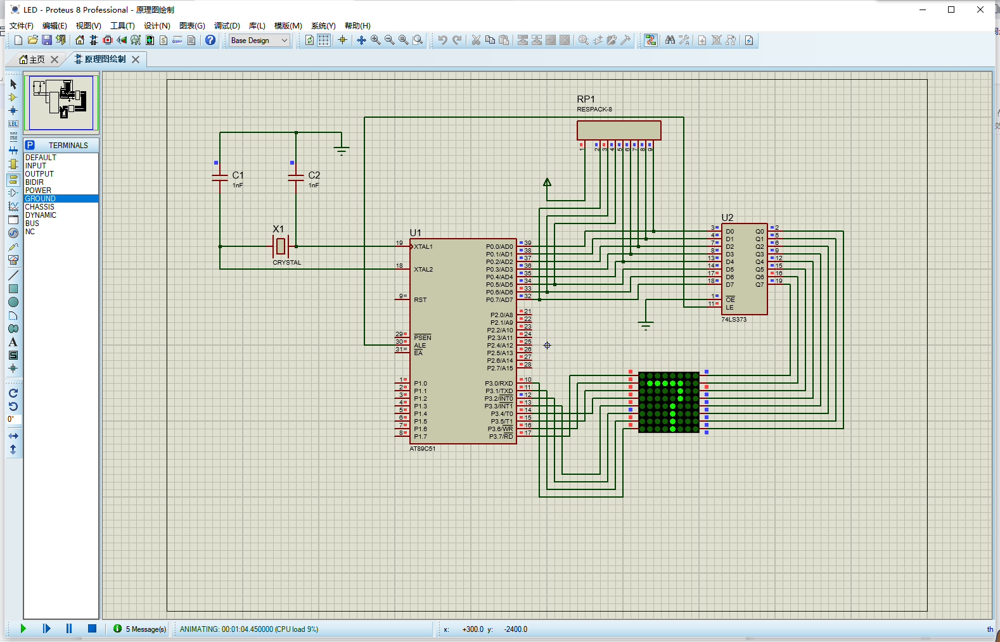

# 🔢 8×8 点阵 LED 显示屏数字轮播项目

```markdown
> 📍 项目作者：Jia'nan Zhao  
> 📅 时间：2021年12月6日  
> 📘 来源：单片机课程设计  
> 🛠️ 工具：Keil C51 + Proteus  
```

---

## 📑 项目简介



本项目使用 **AT89C51 单片机** 驱动 **8×8 LED 点阵显示屏**，以**滚动显示 0～9 的数字**为目标，模拟跑马灯效果。通过 Keil C51 编写汇编语言程序，并使用 Proteus 完成硬件仿真设计和调试。

显示方式采用从左向右的“拉幕”滚动动画，确保字符亮度均匀，显示清晰、稳定、无串扰。

---

## 🧩 硬件组成

| 组件名称         | 作用描述                         |
|------------------|----------------------------------|
| AT89C51 单片机    | 控制核心，负责数码滚动逻辑控制         |
| 74LS373 锁存器    | 用于地址锁存，避免扫描数据残缺        |
| Respack-8 排阻器 | 上拉电阻，稳定信号电平               |
| 8×8 LED 点阵     | 显示模块，负责展示数字内容           |

> 💡 **引脚说明**：
- P0：连接点阵的行信号线  
- P2：连接点阵的列信号线  
- P3：输出列扫描码  

---

## 🔧 电路设计（Proteus）

设计基于 **Proteus 仿真平台**，实现软硬件协同模拟。原理图包括：

- 单片机 AT89C51
- 锁存器 74LS373
- 8×8 LED 点阵
- 排阻 Respack-8

> 📷 电路原理图示意：
> *原文中提供了详细的元器件放置及接线图，可在 Proteus 中直接搭建并测试。*

---

## 💻 软件设计

### 🧠 设计思路

程序采用汇编语言编写，思路如下：

1. 初始化端口及定时器
2. 每列循环点亮一位 LED，实现扫描
3. 使用拉幕计数器控制滚动效果
4. 每 25ms 移动一列，模拟数字滚动
5. 使用中断服务例程处理定时器事件

> 📊 每次显示用 8 行字模，每行一个字节，总计 88 行实现滚动数字。

### 🔤 部分汇编核心代码片段

```asm
MOV DPTR, #TAB        ; 读列码表首地址
MOV A, R_CNT
MOVC A, @A+DPTR
MOV P3, A             ; 输出列码

MOV DPTR, #NUB        ; 行数据地址
MOV A, NUMB
MOVC A, @A+DPTR
MOV P0, A             ; 输出行码
````

> 📦 完整汇编代码请参考原文文档中 "3.2 程序代码" 部分。

---

## 🧪 仿真演示

在 Proteus 中加载由 Keil 编译生成的 `8x8LED.hex` 文件，运行仿真，LED 屏幕将从左向右滚动显示数字 `0~9`，如动画般不断轮播。

> 🎥 示例效果：数字 `7` 从右侧进入，左侧退出，清晰平滑。


---

## 🧩 遇到的问题与解决方案

| 问题描述    | 原因分析     | 解决方法       |
| ------- | -------- | ---------- |
| 点阵不亮    | 缺少锁存器    | 加入 74LS373 |
| 显示为“阴文” | LED 正负接反 | 更换引脚连接方式   |
| 数字镜像反转  | 列码顺序接反   | 调整 P3 引脚顺序 |

---

## 📘 结语

通过本次课程设计，我不仅掌握了 **单片机开发与仿真流程**，还深入理解了 **硬件驱动与软件联调的协作机制**，真正实现了“理论+实践”的融合，提升了系统开发与调试能力。

---

## 📚 参考资料

* 《单片机原理与应用系统设计（第二版）》 马秀丽 等，清华大学出版社
* 《51系列单片机设计实例》 楼然苗，北京航空航天出版社
* 《单片机原理与应用》 唐俊翟，冶金工业出版社
* 《单片机原理及应用教程》 刘瑞新，机械工业出版社

---

